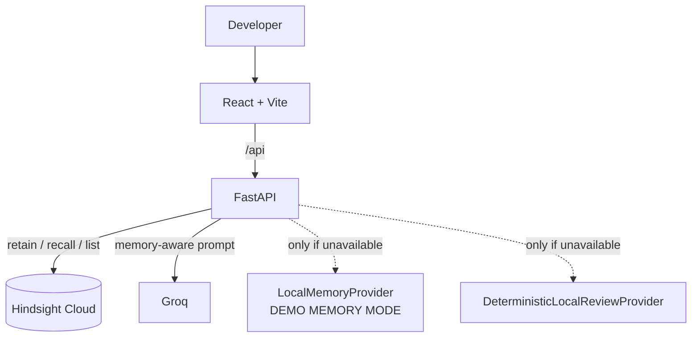
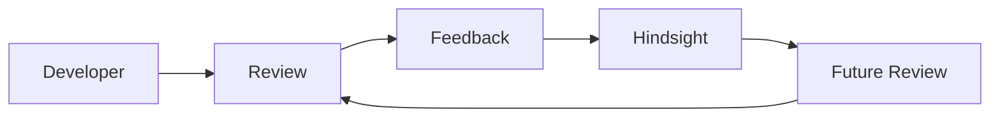

# RepoMind — The Self-Evolving Code Review Agent

> RepoMind doesn't just review code. It remembers how your team builds software.

RepoMind is an AI code-review agent whose memory lives in **[Hindsight](https://hindsight.vectorize.io/)**. Every review can recall what your team has taught it, apply those conventions, and learn more from the developer's feedback — so review N+1 is better than review N.

```
Review → Learn → Remember → Recall → Apply team knowledge → Review better → Learn more
```

## Problem

PR bottlenecks, reviewer fatigue, the same review comment written for the tenth time, and engineering knowledge that leaves with the people who hold it. Stateless AI reviewers don't fix this: a generic model knows that raw SQL is risky, but not that **your team forbids raw SQL in FastAPI handlers because you use a repository abstraction**.

## Solution

RepoMind puts institutional knowledge in Hindsight and makes the difference visible: run a stateless review and a Hindsight review side by side, teach it a new rule, and watch the next review change — with a **"Why was this flagged?"** view that points at the exact memory responsible.

## Features

| # | Feature | Where |
|---|---|---|
| 1 | Hindsight retain / recall behind an isolated provider | `backend/app/memory.py` |
| 2 | Stateless vs Hindsight review, side by side (+ Compare) | Review screen |
| 3 | **Teach Hindsight** (rule + category) | Review screen |
| 4 | **Why was this flagged?** — code, team rule, reason, memory source | every issue |
| 5 | **Memory Bank** with search, category filters, real counts, detail panel | Memory Bank |
| 6 | **Memory Timeline** grouped Today / Yesterday / date | Memory Bank → Timeline |
| 7 | **Self-evolving feedback**: Accept / Reject / Teach as Rule | every issue |
| 8 | **Review feedback** 👍 / 👎 + "Teach RepoMind" | Hindsight panel |
| 9 | **Repository DNA** generated only from memories that exist | Repository DNA |
| 10 | **Memory Impact** analytics from real local events | Analytics |
| 11 | Review modes: General / Security / Architecture / Performance / Full | mode selector |
| 12 | **Memory conflict detector** with "Teach Exception" | Hindsight panel |
| 13 | **Clean PR** detection — "No significant issues found." + conventions checked | preset |
| 14 | **Review History**, reopen any past review | Review History |

Nothing is fabricated: counts, DNA, timeline and analytics are computed from real memories and events. Unknown metadata shows as "Not available".

## Five review problems, five features

Each real-world code-review pain point has a feature that answers it. The **Team Impact** screen shows all five with live numbers from your own reviews.

| # | Problem | What RepoMind does | Where |
|---|---|---|---|
| 1 | **Code review is slow.** Developers wait hours or days for a senior; seniors spend their week reviewing. | Every PR gets an instant **verdict** (Blocked / Needs changes / Ready) and an estimate of senior review time saved. | verdict strip on each review; Team Impact |
| 2 | **The same mistakes repeat.** A newcomer repeats last year's mistake and a senior explains it again. | **Repeat-mistake detector**: an issue seen in earlier, *different* PRs gets a "Seen in N earlier PRs" badge, and once it repeats with no team rule covering it, RepoMind offers to turn it into one. | issue cards; Team Impact |
| 3 | **Knowledge leaves with people.** "We never do X because it broke production" disappears when someone quits. | Every rule stores **who taught it** and **why it exists**. **Export team playbook** downloads all rules as a Markdown document the team owns. | Teach card; Memory Bank; Team Impact |
| 4 | **Reviews are inconsistent.** One reviewer cares about logging, another doesn't. | A **Team standards checklist** holds every review to the same recalled rules and scores compliance. Re-reviewing the same code shows whether the result **stayed consistent**. | Hindsight panel; Team Impact |
| 5 | **AI tools are generic.** ChatGPT/Copilot don't know your company's rules and forget each chat. | **Compare Reviews** runs a generic and a team-aware review in one call and shows **what memory added**: findings a generic AI missed, and generic findings now tied to a team rule. | Compare card; Team Impact |

**Honesty notes.** Everything on Team Impact is counted from stored reviews, except one number: *estimated senior minutes saved*. That is labelled an estimate, and its assumptions (5 min to read a PR + 5 min per issue caught) are constants in `backend/app/insights.py` (`ASSUMPTIONS`). Repeat counts use *distinct* PRs, so re-reviewing the same code never inflates them. The compliance score counts recalled rules the code did not break; it is a consistency aid, not proof the code is correct. RepoMind reads code; it does not run it or replace tests.

## Why Hindsight matters

Hindsight is the **persistent engineering knowledge layer**, not a database bolted on the side:

```
Team knowledge ──► Hindsight retain ──► Persistent memory
                                           │
Developer feedback ◄── Memory-aware review ◄── Groq ◄── Relevant memories ◄── Hindsight recall
        │
        └──► Hindsight retain ──► Better future reviews
```

* **Retain** – rules taught in the UI, seeded conventions, and "Teach as Rule" feedback are written with `POST /v1/default/banks/{bank}/memories`. The bank is configured with a `retain_mission` so Hindsight extracts *team conventions* as standalone rules.
* **Recall** – before each memory-enabled review, RepoMind builds a query from the PR title, the topics detected in the diff, and the review mode, then calls `POST …/memories/recall`. Only recalled memories are given to the LLM.
* **Apply** – the memory-aware prompt tells Groq to cite memories, separate general best practice from team convention, never invent memories, and explain conflicts instead of silently choosing. Citations are validated server-side: a memory id the model was never given is dropped.
* **Learn** – feedback marked "Teach as Rule" is retained, so the very next review can use it.
* **Stateless mode never calls Hindsight** (`bypass_memory=true`), which is what makes the comparison honest.

### Memory lifecycle

1. Developer teaches a rule (or accepts/teaches from a finding).
2. `retain()` → Hindsight extracts and stores it (tagged `repomind`, `category:*`).
3. A later PR is submitted; diff topics steer `recall()`.
4. Relevant memories are ranked, passed to the reviewer, cited on issues; usage is counted locally (`times applied`, `last used`).
5. Developer feedback becomes new memory. Loop.

## Architecture





## Tech stack

Python 3.10+, FastAPI, Uvicorn, Pydantic, python-dotenv, httpx, Groq SDK · React 18 + Vite (no UI framework) · Hindsight Cloud REST API.

## Repository structure

```
repomind/
├── backend/
│   ├── .env.example
│   ├── requirements.txt
│   ├── app/
│   │   ├── main.py       # FastAPI app + endpoints, clean JSON errors
│   │   ├── service.py    # review pipeline, teach, feedback, analytics, DNA
│   │   ├── memory.py     # HindsightMemoryProvider + LocalMemoryProvider
│   │   ├── llm.py        # Groq prompts, JSON parsing, citation validation
│   │   ├── reviewer.py   # DeterministicLocalReviewProvider + conflict detector
│   │   ├── topics.py     # topic taxonomy linking code signals to memories
│   │   ├── store.py      # local JSON state (history, events, usage, demo memory)
│   │   ├── models.py, config.py
│   └── tests/test_api.py # 21 tests
└── frontend/
    ├── src/App.jsx, api.js, presets.json, styles.css, App.test.jsx
    └── src/components/   # DiffEditor, ReviewPanel, IssueCard, WhyModal, TeachCard, MemoryBank, Pages
```

## Setup

### Environment variables (`backend/.env`, copy from `.env.example`)

| Variable | Purpose |
|---|---|
| `GROQ_API_KEY` | Groq key. Optional — without it the deterministic local reviewer is used. |
| `GROQ_MODEL` | `openai/gpt-oss-120b` (default), `qwen/qwen3.6-27b`, or `openai/gpt-oss-20b`. Groq retired `llama-3.3-70b-versatile` (2026-08-16) and `qwen/qwen3-32b` (2026-07-17); using them shows Groq as DEGRADED (`NotFoundError`). |
| `HINDSIGHT_API_KEY` | Hindsight Cloud key. Optional — without it the app runs in DEMO MEMORY MODE. |
| `HINDSIGHT_BASE_URL` | `https://api.hindsight.vectorize.io` |
| `HINDSIGHT_BANK_ID` | Memory bank, default `repomind` (created automatically if missing) |
| `FRONTEND_ORIGIN` | CORS origin, default `http://localhost:5173` |

Keys are read only by the backend and are never sent to React or included in API responses or errors.

### Hindsight setup
1. Sign in at <https://ui.hindsight.vectorize.io/> and create an API key.
2. Put it in `HINDSIGHT_API_KEY`. Start the backend; the header should read **HINDSIGHT CONNECTED**.
3. Click **Seed team knowledge** once (idempotent — seeds use stable `document_id`s).

### Groq setup
Create a key at <https://console.groq.com/>, set `GROQ_API_KEY`. Header shows **Groq READY**. If a call fails, that review transparently uses the local engine and says so in the panel.

### Run the backend
```bash
cd backend
python -m venv .venv && source .venv/bin/activate      # Windows: .venv\Scripts\activate
pip install -r requirements.txt
cp .env.example .env                                   # add keys (optional)
uvicorn app.main:app --reload --port 8000
```

### Run the frontend
```bash
cd frontend
npm install
npm run dev            # http://localhost:5173  (proxies /api → :8000)
npm run build          # production build
```

### Tests
```bash
cd backend && pytest -q                 # 21 API/contract tests, no network needed
cd frontend && npm test                 # UI smoke test; needs the backend running on :8000
```

## Fallback behavior

| Situation | Behavior | UI label |
|---|---|---|
| Hindsight key missing or Hindsight unreachable | `LocalMemoryProvider` (JSON file) | **DEMO MEMORY MODE** |
| Hindsight fails mid-request | that request falls back; a warning is shown | warning banner in the panel |
| Groq key missing or Groq call fails | `DeterministicLocalReviewProvider` (rules engine, no LLM) | "Local review engine (no LLM)" |

Fallback data is **never labelled Hindsight** — `memory_provider` is `hindsight`, `local`, or `none`. Memories saved while in fallback do not exist in Hindsight.

## API

| Endpoint | Purpose |
|---|---|
| `GET /api/health` | memory mode, Hindsight/Groq status, memory count |
| `POST /api/review` | `{code_diff, pr_title, bypass_memory, review_mode}` → `review, memories, memory_count, groq_latency_ms, memory_enabled, memory_provider, issues, review_id` (+ conflicts, warnings, `verdict`, `time_saved_min`, `scorecard`, `consistency`; each issue has `seen_before`, `suggest_rule`) |
| `POST /api/teach` | `{rule, category, owner?, reason?}` → retain a rule (with who taught it and why) |
| `POST /api/compare` | `{code_diff, pr_title, review_mode}` → `{plain, memory, delta}`: both reviews plus what memory added |
| `GET /api/impact` | the five pain-point dashboards (speed, repeat mistakes, knowledge, consistency, generic vs team) |
| `GET /api/playbook` | `{filename, count, markdown}`: the team playbook |
| `GET /api/memories?q=&category=` | memories, per-category counts, usage |
| `POST /api/seed` | seed 9 team conventions |
| `GET /api/history`, `GET /api/history/{id}` | review history / reopen |
| `POST /api/feedback` | `{review_id, issue_id, feedback_type, comment, teach_as_rule}` |
| `GET /api/analytics` | real counters |
| `GET /api/repository-dna` | DNA from memories |
| `POST /api/reset-demo` | clears **local** demo state only (never Hindsight) |

Diffs are limited to 20,000 characters; errors are clean JSON `{"error": {"code", "message"}}` with proper status codes and no stack traces; all outbound calls have timeouts; submitted code is not logged.

## Demo instructions (60 seconds)

1. Load **Raw SQL Vulnerability**.
2. **Review Without Memory** → "SQL Injection Risk", "use parameterized queries."
3. **Review With Hindsight** → *Team convention violated: database access bypasses the repository layer*, with **Memory used: Database rule — "All database access must go through repository/db.py…"**
4. **Teach Hindsight**: "All FastAPI route handlers must remain thin. Database access must never happen directly inside API routes." (Architecture)
5. **Review With Hindsight** again → new finding *route handler is not thin*, citing the new memory.
6. Click **Why?** → code, team rule, reason, memory source.
7. Optional: teach "Analytics endpoints may use direct read-only SQL." and re-review to see **Memory conflict → Teach Exception**.

### 60-second pitch
* **0–10s** — "Most AI code reviewers understand code, but they don't remember how your team works."
* **10–20s** — Load Raw SQL Vulnerability. Run the stateless review.
* **20–35s** — Run the Hindsight review. Show the exact team rule.
* **35–45s** — Teach a new rule.
* **45–55s** — Run the review again. Show the new rule being applied.
* **55–60s** — "RepoMind doesn't just review code. It remembers how your team builds software."

### Demo video checklist
1. Product introduction 2. Problem 3. Stateless review 4. Hindsight review 5. Memory recall (chips + Memory used) 6. Teach memory 7. Improved review + Why? 8. Repository DNA 9. Memory Timeline. Confirm the header says **HINDSIGHT CONNECTED** before recording.

## Hackathon submission checklist
- [ ] Hindsight is core (retain, recall, list, bank missions) — see *How RepoMind uses Hindsight*
- [ ] Demo shows memory recalled, applied, and improving across reviews
- [ ] Developer can teach; taught rule changes the next review
- [ ] Recorded with a real `HINDSIGHT_API_KEY` (not DEMO MEMORY MODE)
- [ ] Clean GitHub repo (`.env` not committed), README, demo video link
- [ ] Article and social post published

**Challenge mapping:** Challenge mapping should be populated from the official Content Guide.

## Article outline
1. The stateless-reviewer problem 2. What "institutional memory" means for code review 3. Why Hindsight (retain / recall, banks, missions) 4. The loop: review → feedback → retain → recall 5. Honest fallbacks and citation validation 6. What changed between review 1 and review 2 (screenshots) 7. Lessons + what's next.

## Social post outline
Hook (stateless vs remembers) → 10-second GIF of teach → re-review → one line on Hindsight retain/recall → repo + demo link → tags.

## Verification status (be honest in your submission)
Verified in a sandbox with **no network access to Hindsight or Groq**: backend imports/starts, all endpoints, review/teach/feedback loop, fallback mode, 21 backend tests, frontend build, and a UI smoke test of the full demo flow. The Hindsight provider is verified against the documented REST contract with a mocked transport; the Groq path with its network call replaced. **The first run with real keys is your live integration test** — check that the header reads HINDSIGHT CONNECTED and that *Seed → Memory Bank* lists facts. Hindsight extracts facts from what you retain, so a memory's text in the Memory Bank may be lightly reworded from what you typed.

**Team Impact features (five pain points), what was and wasn't run.** The pure logic in `backend/app/insights.py` has 12 unit tests (`backend/tests/test_insights.py`), all passing. The full review pipeline (`Service.review / compare / impact / playbook / teach`) was exercised end to end, and the real `<App/>` was rendered in jsdom against the service's actual payloads (compare card, verdicts, checklist, repeat badges, Team Impact page, owner/reason in the Memory Bank, history verdict column) with every check passing. **Not run in that sandbox** because FastAPI/pydantic and the Windows-built `vite`/`esbuild` binaries were unavailable: the new FastAPI-level tests in `backend/tests/test_api.py` and the new case in `frontend/src/App.test.jsx`. Run `pytest -q` (backend) and `npm test` (frontend, backend running) on your machine to confirm them.
